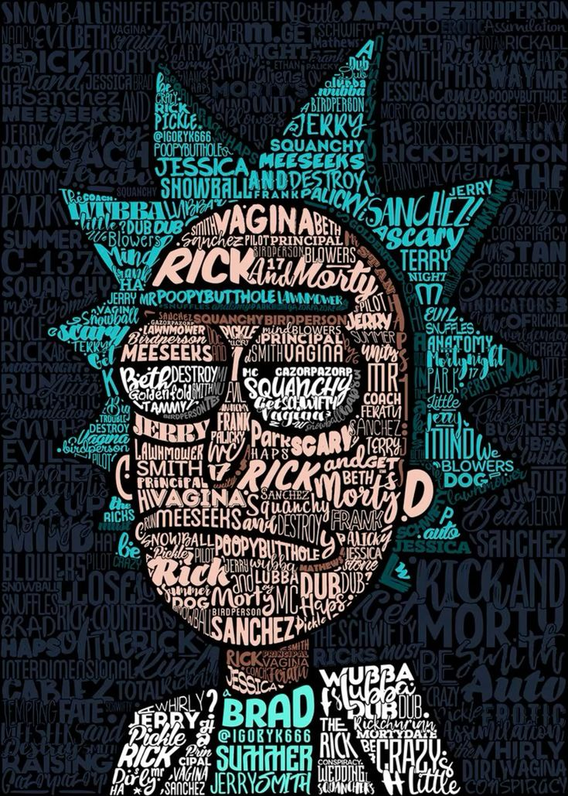

# 🧪 Rick and Morty Directory



> **Evrenin en çılgın karakterlerini, lokasyonlarını ve bölümlerini keşfedin!**  
> Bu proje, Rick and Morty API'sini kullanarak modern web teknolojileriyle geliştirilmiş, performans odaklı ve kullanıcı dostu bir rehber uygulamasıdır.

---

<div align="center">


</div>

---

## 🚀 Özellikler (Features)

Bu uygulama, modern web geliştirme standartlarına uygun olarak tasarlanmıştır:

- **⚡ Server-Side Rendering (SSR) & Prefetching:** Sayfalar sunucu tarafında oluşturulur ve veri önceden çekilerek (hydration mismatch olmadan) anında yüklenir. React Query `prefetchQuery` stratejisi ile SEO dostu yapı.
- **🔗 URL State Senkronizasyonu (`nuqs`):** Filtreleme işlemleri (Status, Gender vb.) anlık olarak URL'e yansır. Sayfayı yenileseniz veya linki arkadaşınıza gönderseniz bile aynı filtreleme durumu korunur.
- **🎨 Modern ve Responsive UI:** Shadcn UI ve Tailwind CSS kullanılarak oluşturulmuş, mobil uyumlu ve erişilebilir arayüz.
- **🌑 Dark & Light Mode:** Kullanıcı tercihine saygı duyan tema desteği.
- **🧩 Modüler Mimari:** Atomik tasarım prensiplerine yakın, tekrar kullanılabilir bileşen yapısı (`src/components/core`, `src/components/features`).
- **🛡️ Type-Safety:** Uçtan uca TypeScript desteği ile güvenli kod geliştirme.

## 🛠️ Teknoloji Yığını (Tech Stack)

Proje, güncel ve popüler kütüphanelerle güçlendirilmiştir:

| Kategori          | Teknoloji                                     | Açıklama                                                |
| ----------------- | --------------------------------------------- | ------------------------------------------------------- |
| **Core**          | [Next.js 16](https://nextjs.org/)             | App Router mimarisi ile güçlü frontend framework'ü.     |
| **Language**      | [TypeScript](https://www.typescriptlang.org/) | Statik tip kontrolü.                                    |
| **Styling**       | [Tailwind CSS](https://tailwindcss.com/)      | Utility-first CSS framework.                            |
| **Components**    | [Shadcn UI](https://ui.shadcn.com/)           | Erişilebilir ve özelleştirilebilir bileşen kütüphanesi. |
| **Data Fetching** | [TanStack Query](https://tanstack.com/query)  | Asenkron state yönetimi ve caching.                     |
| **URL State**     | [Nuqs](https://nuqs.47ng.com/)                | Type-safe search params state yönetimi.                 |
| **Icons**         | [Lucide React](https://lucide.dev/)           | Tutarlı ve hafif ikon seti.                             |

## 📂 Proje Yapısı

```bash
src/
├── app/              # Next.js App Router sayfaları
│   ├── (main)/       # Ana layout ve sayfalar (Character, Location, Episode)
│   └── layout.tsx    # Root layout
├── components/       # UI bileşenleri
│   ├── core/         # Temel bileşenler (Button, Input, Select...)
│   ├── features/     # Özellik bazlı bileşenler (CharacterCard, FilterBar...)
│   └── forms/        # Form elemanları
├── hooks/            # Custom React hook'ları (useRickAndMorty.ts)
├── lib/              # Utility fonksiyonları ve config (get-query-client.ts)
└── types/            # TypeScript tip tanımları
```

## 🏁 Kurulum (Getting Started)

Projeyi yerel ortamınızda çalıştırmak için aşağıdaki adımları izleyin:

1.  **Repo'yu klonlayın:**

    ```bash
    git clone https://github.com/your-username/case-rick-and-morty.git
    cd case-rick-and-morty
    ```

2.  **Bağımlılıkları yükleyin:**

    ```bash
    npm install
    # veya
    yarn install
    ```

3.  **Çevresel Değişkenleri Ayarlayın (.env.local):**

    ```bash
    cp .env.example .env.local
    # NEXT_PUBLIC_API_BASE_URL=https://rickandmortyapi.com/api
    ```

4.  **Geliştirme sunucusunu başlatın:**

    ```bash
    npm run dev
    ```

5.  Tarayıcınızda [http://localhost:3000](http://localhost:3000) adresine gidin.

---

## 📸 Geliştirme Notları

- **Veri Fetching:** Tüm veri çekme işlemleri `src/hooks/useRickAndMorty.ts` içinde merkezileştirilmiştir. Hem Server Component'ler hem de Client Component'ler (Hook'lar) aynı fetch fonksiyonlarını kullanır.
- **Performans:** Filtreleme işlemlerinde `shallow: false` kullanılarak Next.js'in sunucu tarafı render yeteneklerinden faydalanılır.
- **Sonsuz Döngü Koruması:** Filtre bileşenlerinde `useEffect` bağımlılıkları optimize edilerek Form State ve URL State arasındaki sonsuz döngüler engellenmiştir.

---

Made with ❤️ by [Zafer Gök](https://github.com/zafergok)
